# Diagramas de Fluxo — Meu Tempo · Gerenciador de Tarefas (v1)

_Gerado a partir de `requisitos-time-control.md` (aprovado em 2026-07-19). Apenas
fluxogramas dos casos de uso com lógica de decisão._

---

## Cenários e Critérios de Aceite (fonte: requisitos aprovados)

> IDs estáveis usados como referência em todos os fluxos abaixo. Os critérios são
> os "pronto quando" do documento de requisitos.

### Cenários

| ID | Cenário | Descrição (do documento) |
|----|---------|--------------------------|
| `CEN-01` | Criar tarefa em 3 níveis | "Tarefas em 3 níveis (mãe → filha → neta); campos e cronômetro só na folha; mãe/avó herdam a soma" |
| `CEN-02` | Registrar tempo | "Cronômetro (só folha/compromisso) e manual; 1 ativo por vez com pausa automática; tempo acumula na mãe/avó" |
| `CEN-03` | Migração de pendências | "No dia seguinte, o app mostra as tarefas não feitas para migrar ou descartar" |
| `CEN-04` | Cabe no dia | "Avisar se a soma das durações estimadas (tarefas + compromissos) passa das horas disponíveis" |
| `CEN-06` | Listagem por prioridade | "Lista plana só das folhas, ordenada por tempoEstimado × (5 − importância) × urgênciaDoPrazo" |
| `CEN-10` | Conclusão e progresso | "Concluir folha; mãe conclui sozinha quando todas as filhas terminam; barra de progresso" |
| `CEN-11` | Editar, excluir e mover | "Editar campos; excluir em cascata com confirmação; mover na hierarquia reatribui o tempo" |
| `CEN-12` | Criação rápida (sem fricção) | "Criar só com o título; nasce com valores padrão e já entra na listagem" |
| `CEN-13` | Desfazer (usuário leigo) | "Após concluir, excluir ou migrar, oferecer desfazer para reverter" |
| `CEN-14` | Agenda e compromissos | "Compromisso com hora de início + duração; agenda do dia; ocupa o cabe-no-dia; lista; cronômetro" |

### Critérios de Aceite

| ID | Cenário | Critério de Aceite (do documento) |
|----|---------|-----------------------------------|
| `CA-01` | `CEN-01` | "Crio mãe → filha → neta e só na neta (folha) informo tempo estimado, data e importância" |
| `CA-01b` | `CEN-01` | "A mãe e a avó herdam a soma dos tempos das folhas (calculado, não digitado)" |
| `CA-02` | `CEN-02` | "Dou start numa folha; ao dar start em outra, a primeira pausa sozinha; o tempo soma na mãe e na avó" |
| `CA-02b` | `CEN-02` | "Consigo digitar o tempo manualmente (ex.: 1h30) numa folha" |
| `CA-03` | `CEN-03` | "Deixo uma tarefa sem concluir hoje e amanhã o app pergunta migrar ou descartar" |
| `CA-04` | `CEN-04` | "Defino 8h disponíveis; ao planejar 9h entre tarefas e compromissos, o app avisa que passou" |
| `CA-06` | `CEN-06` | "Importante(1) de 2h vencendo hoje pontua 48 e fica acima da mesma vencendo em 4 dias (32)" |
| `CA-06b` | `CEN-06` | "Cada folha exibe subtítulo com a mãe e a avó" |
| `CA-10a` | `CEN-10` | "Marco uma folha como feita e ela sai da listagem de prioridade" |
| `CA-10b` | `CEN-10` | "Marco as 5 folhas de uma mãe e a mãe fica concluída sozinha (barra 100%); 3 de 5 → 60%" |
| `CA-11a` | `CEN-11` | "Mudo a data de uma tarefa e a prioridade dela se recalcula" |
| `CA-11b` | `CEN-11` | "Movo uma neta para virar filha de outra mãe e o tempo passa a acumular na nova mãe" |
| `CA-11c` | `CEN-11` | "Excluo uma tarefa com filhas e o app apaga tudo, pedindo confirmação antes" |
| `CA-12` | `CEN-12` | "Crio uma tarefa só com o título; ela nasce com padrões (imp. 4, hoje, 30min, Entrada) e entra na listagem" |
| `CA-13` | `CEN-13` | "Ao excluir uma tarefa por engano, um desfazer a traz de volta" |
| `CA-14` | `CEN-14` | "Crio 'Reunião hoje 15h, 1h' na lista Profissional; aparece na agenda às 15h, desconta 1h do dia e soma no relatório da lista" |

---

## 1. Diagrama de Fluxo — CriarTarefaUseCase · CEN-01, CEN-12, CEN-13

> Cenário(s): `CEN-01` (criar em 3 níveis), `CEN-12` (criação rápida) — critérios `CA-01`, `CA-01b`, `CA-12`.

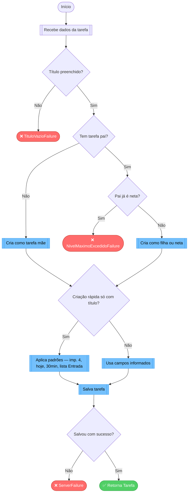

### Decisões mapeadas (losangos)

| Decisão | Failure (caminho Não) | Onde implementar | Ref (CEN/CA) |
|---------|-----------------------|------------------|--------------|
| Título preenchido? | `TituloVazioFailure` | `CriarTarefaUseCase` (validação de entrada) | — (regra técnica: título é obrigatório mesmo na criação rápida) |
| Tem tarefa pai? | — (desvio, não é erro) | `CriarTarefaUseCase` | `CA-01` |
| Pai já é neta? | `NivelMaximoExcedidoFailure` | `CriarTarefaUseCase` (limite de 3 níveis) | `CA-01` |
| Criação rápida só com título? | — (desvio para padrões) | `CriarTarefaUseCase` | `CA-12` |
| Salvou com sucesso? | `ServerFailure` | `TarefaRepository.criar` (try/catch) | `CA-12` |

---

## 2. Diagrama de Fluxo — IniciarCronometroUseCase · CEN-02

> Cenário(s): `CEN-02` (registrar tempo) — critério `CA-02`.

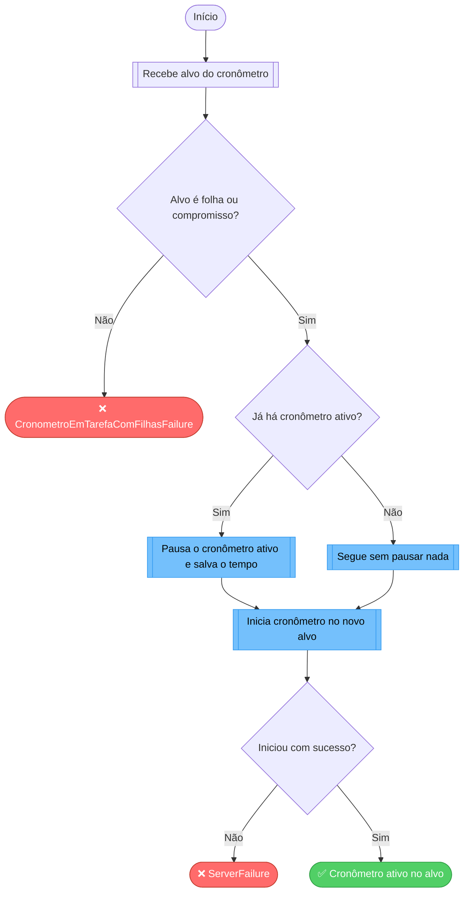

### Decisões mapeadas (losangos)

| Decisão | Failure (caminho Não) | Onde implementar | Ref (CEN/CA) |
|---------|-----------------------|------------------|--------------|
| Alvo é folha ou compromisso? | `CronometroEmTarefaComFilhasFailure` | `IniciarCronometroUseCase` (só folha/compromisso tem cronômetro) | `CA-02` |
| Já há cronômetro ativo? | — (desvio: pausa o anterior) | `IniciarCronometroUseCase` (estado global "cronômetro ativo") | `CA-02` |
| Iniciou com sucesso? | `ServerFailure` | `TempoRepository.iniciar` (try/catch) | `CA-02` |

---

## 3. Diagrama de Fluxo — RegistrarTempoManualUseCase · CEN-02

> Cenário(s): `CEN-02` (registrar tempo) — critério `CA-02b`.

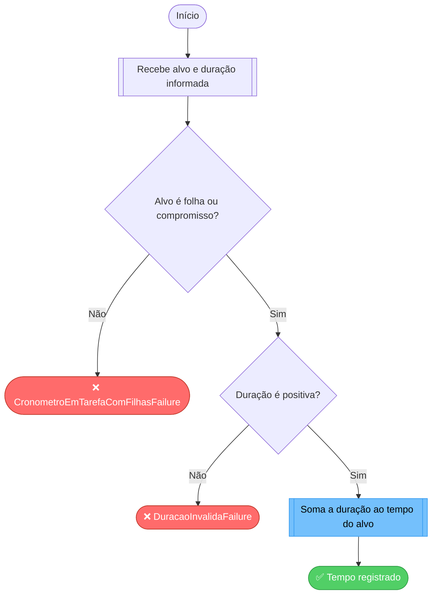

### Decisões mapeadas (losangos)

| Decisão | Failure (caminho Não) | Onde implementar | Ref (CEN/CA) |
|---------|-----------------------|------------------|--------------|
| Alvo é folha ou compromisso? | `CronometroEmTarefaComFilhasFailure` | `RegistrarTempoManualUseCase` | `CA-02b` |
| Duração é positiva? | `DuracaoInvalidaFailure` | `RegistrarTempoManualUseCase` | — (regra técnica: duração manual > 0) |

---

## 4. Diagrama de Fluxo — CalcularPrioridadeUseCase · CEN-06

> Cenário(s): `CEN-06` (listagem por prioridade) — critério `CA-06`.
> Este fluxo calcula a `urgênciaDoPrazo` (faixas) e a prioridade final de cada folha.

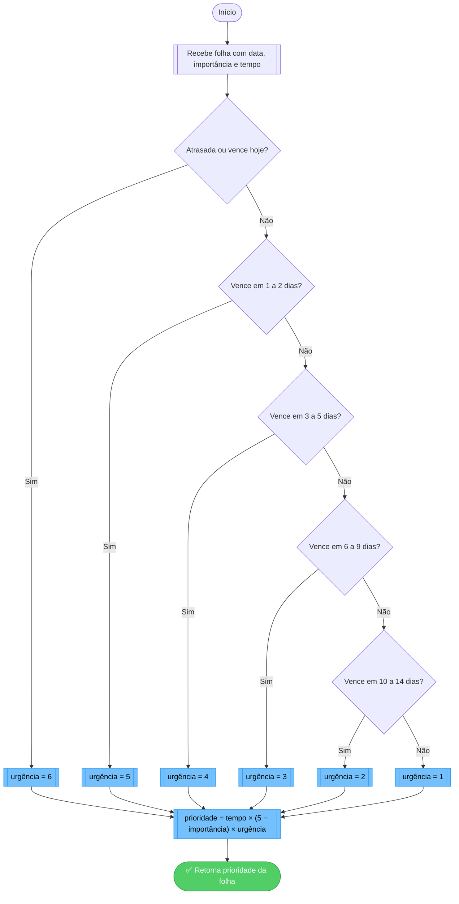

### Decisões mapeadas (losangos)

| Decisão | Failure (caminho Não) | Onde implementar | Ref (CEN/CA) |
|---------|-----------------------|------------------|--------------|
| Faixas de vencimento (hoje…+14 dias) | — (sem erro: define o multiplicador de urgência) | `CalcularPrioridadeUseCase` (função de faixas) | `CA-06` |

> Observação: este fluxo **não tem caminho de erro** — é um cálculo puro em memória
> (sem I/O), portanto é uma **exceção consciente** à regra de "todo fluxo tem um nó
> de erro". A ordenação da lista aplica esta prioridade a cada folha e ordena do
> maior para o menor.

---

## 5. Diagrama de Fluxo — ConcluirTarefaUseCase · CEN-10

> Cenário(s): `CEN-10` (conclusão e progresso) — critérios `CA-10a`, `CA-10b`.

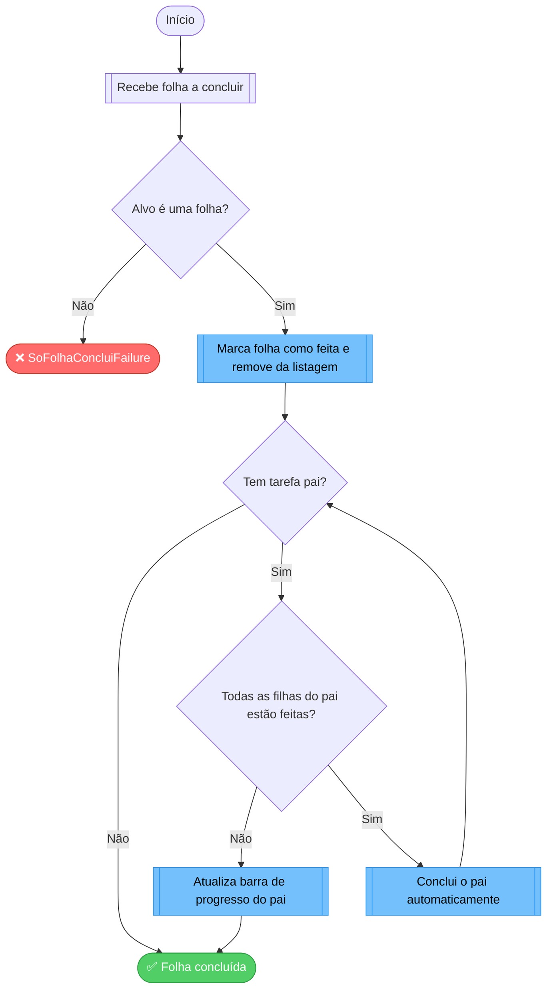

### Decisões mapeadas (losangos)

| Decisão | Failure (caminho Não) | Onde implementar | Ref (CEN/CA) |
|---------|-----------------------|------------------|--------------|
| Alvo é uma folha? | `SoFolhaConcluiFailure` | `ConcluirTarefaUseCase` | `CA-10a` |
| Todas as filhas do pai estão feitas? | — (desvio: conclui o pai ou só atualiza progresso) | `ConcluirTarefaUseCase` (sobe recursivamente até a avó) | `CA-10b` |

> A volta de `I` para `F` representa a **subida recursiva**: ao concluir o pai, o
> mesmo teste é aplicado ao avô.

---

## 6. Diagrama de Fluxo — MigrarTarefasUseCase · CEN-03

> Cenário(s): `CEN-03` (migração) — critério `CA-03`.

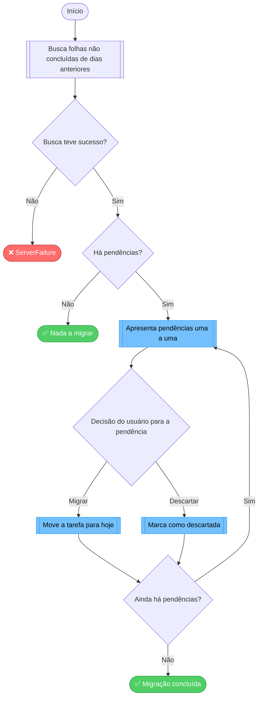

### Decisões mapeadas (losangos)

| Decisão | Failure (caminho Não) | Onde implementar | Ref (CEN/CA) |
|---------|-----------------------|------------------|--------------|
| Busca teve sucesso? | `ServerFailure` | `TarefaRepository.buscarPendencias` (try/catch) | `CA-03` |
| Há pendências? | — (sem erro: se não houver, encerra) | `MigrarTarefasUseCase` | `CA-03` |
| Decisão do usuário (migrar/descartar) | — (dois desvios válidos) | `MigrarTarefasUseCase` | `CA-03` |

> As saídas "Migrar"/"Descartar" são caminhos válidos escolhidos pelo usuário, não
> erros; o único `Failure` é a falha ao buscar as pendências.

---

## 7. Diagrama de Fluxo — VerificarCabeNoDiaUseCase · CEN-04

> Cenário(s): `CEN-04` (cabe no dia) — critério `CA-04`.

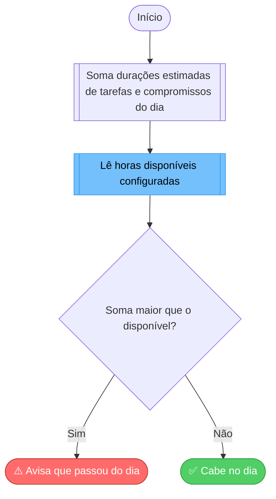

### Decisões mapeadas (losangos)

| Decisão | Failure (caminho Não) | Onde implementar | Ref (CEN/CA) |
|---------|-----------------------|------------------|--------------|
| Soma maior que o disponível? | Aviso "não cabe no dia" (não bloqueia, só alerta) | `VerificarCabeNoDiaUseCase` | `CA-04` |

> O "erro" aqui é um **aviso**, não um bloqueio: o usuário ainda pode planejar
> além do dia; o app apenas sinaliza.

---

## 8. Diagrama de Fluxo — ExcluirTarefaUseCase · CEN-11

> Cenário(s): `CEN-11` (editar/excluir/mover) — critério `CA-11c`.

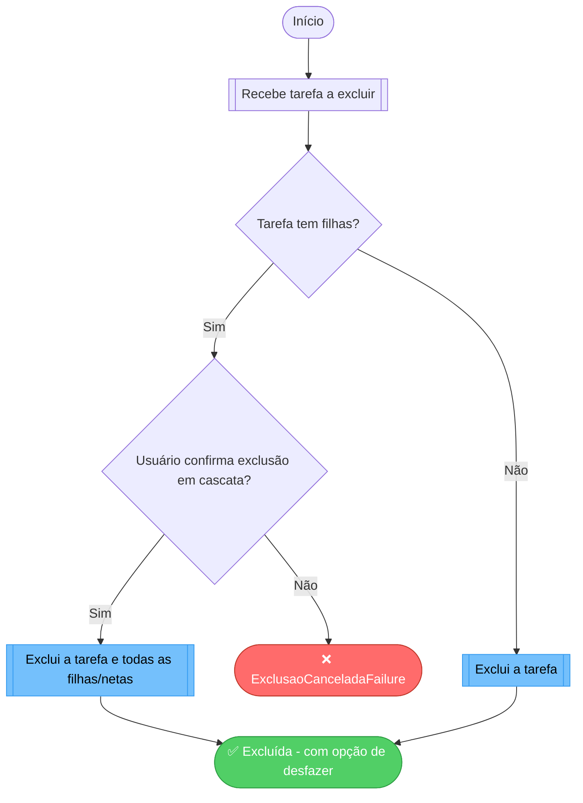

### Decisões mapeadas (losangos)

| Decisão | Failure (caminho Não) | Onde implementar | Ref (CEN/CA) |
|---------|-----------------------|------------------|--------------|
| Tarefa tem filhas? | — (desvio: com filhas exige confirmação) | `ExcluirTarefaUseCase` | `CA-11c` |
| Usuário confirma cascata? | `ExclusaoCanceladaFailure` | `ExcluirTarefaUseCase` / camada de UI | `CA-11c` |

> O sucesso oferece **desfazer** (ver fluxo 10), conforme `CEN-13`.

---

## 9. Diagrama de Fluxo — MoverTarefaUseCase · CEN-11

> Cenário(s): `CEN-11` (mover na hierarquia) — critério `CA-11b`.

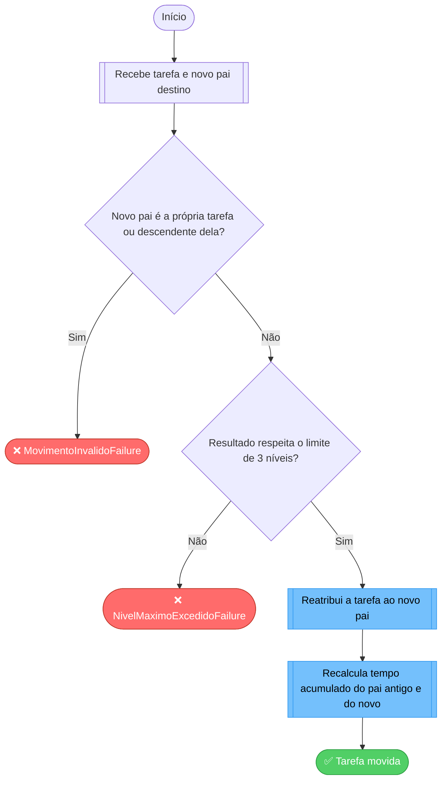

### Decisões mapeadas (losangos)

| Decisão | Failure (caminho Não) | Onde implementar | Ref (CEN/CA) |
|---------|-----------------------|------------------|--------------|
| Novo pai é a própria tarefa ou descendente? | `MovimentoInvalidoFailure` | `MoverTarefaUseCase` | — (regra técnica: evita ciclo na hierarquia) |
| Resultado respeita 3 níveis? | `NivelMaximoExcedidoFailure` | `MoverTarefaUseCase` | `CA-01` |
| (sucesso) recalcula tempo dos dois pais | — | `MoverTarefaUseCase` | `CA-11b` |

---

## 10. Diagrama de Fluxo — DesfazerUseCase · CEN-13

> Cenário(s): `CEN-13` (usuário leigo) — critério `CA-13`.

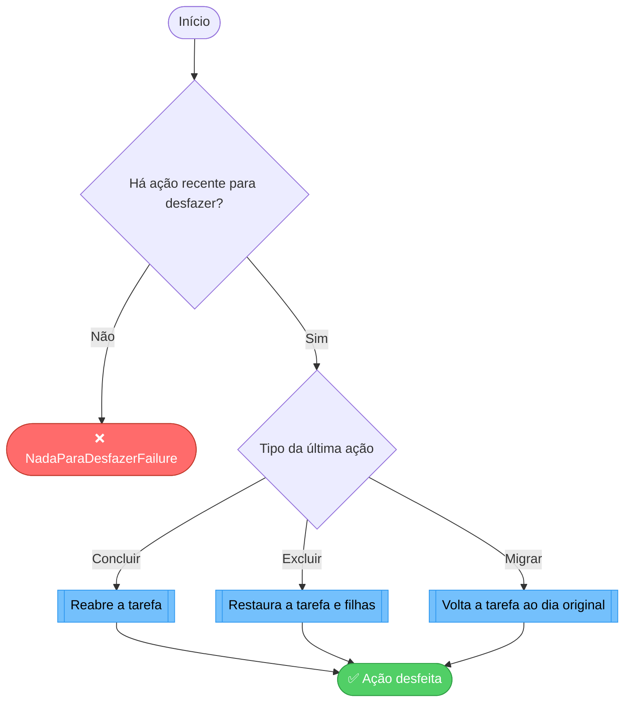

### Decisões mapeadas (losangos)

| Decisão | Failure (caminho Não) | Onde implementar | Ref (CEN/CA) |
|---------|-----------------------|------------------|--------------|
| Há ação recente para desfazer? | `NadaParaDesfazerFailure` | `DesfazerUseCase` (pilha da última ação) | `CA-13` |
| Tipo da última ação | — (três desvios de reversão) | `DesfazerUseCase` | `CA-13` |

---

## 11. Diagrama de Fluxo — CriarCompromissoUseCase · CEN-14

> Cenário(s): `CEN-14` (agenda e compromissos) — critério `CA-14`.

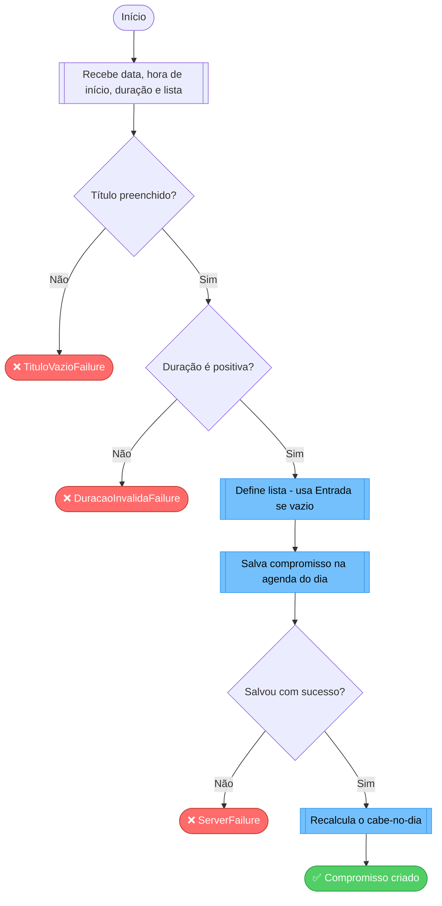

### Decisões mapeadas (losangos)

| Decisão | Failure (caminho Não) | Onde implementar | Ref (CEN/CA) |
|---------|-----------------------|------------------|--------------|
| Título preenchido? | `TituloVazioFailure` | `CriarCompromissoUseCase` | — (regra técnica) |
| Duração é positiva? | `DuracaoInvalidaFailure` | `CriarCompromissoUseCase` | `CA-14` |
| Salvou com sucesso? | `ServerFailure` | `CompromissoRepository.criar` | `CA-14` |
| (sucesso) recalcula cabe-no-dia | — | `VerificarCabeNoDiaUseCase` | `CA-04`, `CA-14` |

---

## 12. Diagrama de Fluxo — ExcluirListaUseCase · CEN-11

> Cenário(s): `CEN-11` (excluir) aplicado a listas — critério derivado do Requisito 5.

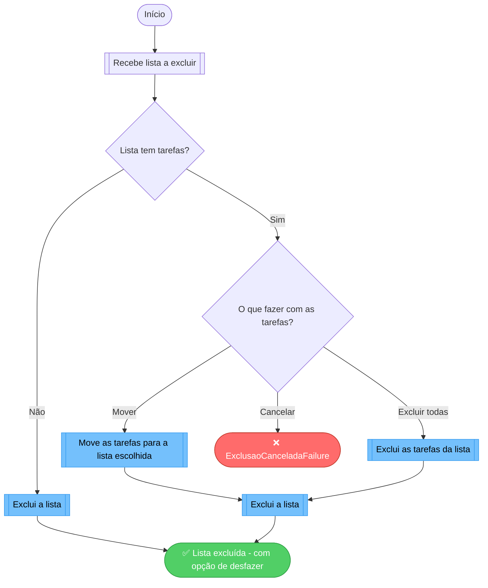

### Decisões mapeadas (losangos)

| Decisão | Failure (caminho Não) | Onde implementar | Ref (CEN/CA) |
|---------|-----------------------|------------------|--------------|
| Lista tem tarefas? | — (desvio: sem tarefas exclui direto) | `ExcluirListaUseCase` | Requisito 5 |
| O que fazer com as tarefas? | `ExclusaoCanceladaFailure` (se cancelar) | `ExcluirListaUseCase` / UI (pergunta ao usuário) | Requisito 5 |

---

## Requisitos SEM fluxograma (sem lógica de decisão)

Para não passar a impressão de que foram esquecidos, os requisitos abaixo são
**lineares** (CRUD simples ou leitura) e não geram fluxograma nesta entrega:

| Requisito | Motivo |
|-----------|--------|
| 6 — Listagem (ordenação) | A ordenação em si é linear; a parte com decisão (cálculo da urgência) está no fluxo 4. |
| 7 — Relatórios | Leitura e agregação; sem ramificação. |
| 8 — Login | Autenticação padrão do Firebase; sem regra de negócio própria. |
| 9 — Backup na nuvem | Persistência automática; sem ramificação. |
| 12 — Cronômetro em 1 toque / +15/+30 / padrões | Atalhos de UI sobre fluxos já cobertos (1 e 2). |
| 13 — Começar simples / telas que ensinam / 1º acesso | Comportamento de UI, sem decisão de negócio (o "desfazer" está no fluxo 10). |

_Nenhuma pendência de decisão em aberto — todos os fluxos têm regra definida._
